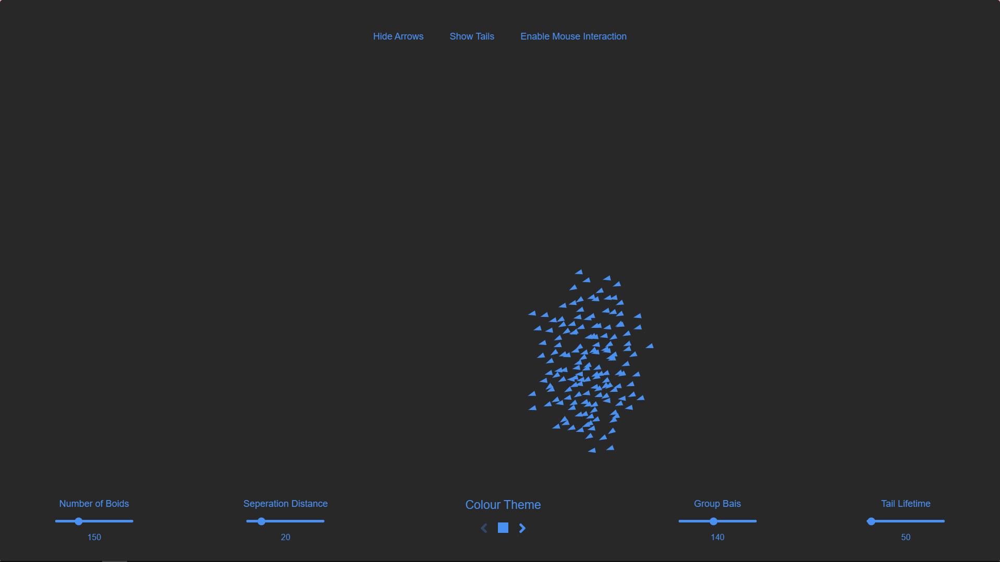

# Boid Simulations

###### Live at [boids.dev](https://boids.dev)

An interactive tool that allows users to experiment with settings on a group of boids, simulating the behavior of animals in flocks or swarms.

## Table of Contents

- [Introduction](#introduction)
- [Features](#features)
- [Getting Started](#getting-started)
- [Usage](#usage)
- [Examples](#examples)
- [Technologies Used](#technologies-used)
- [Inspiration](#inspiration)
- [Contributing](#contributing)
- [License](#license)

## Introduction

This project implements a boid simulation, which models the flocking behavior of birds or other animals. Boids follow simple rules that, when combined, create complex and lifelike group movements.

## Features

- Real-time simulation of boid behavior
- Adjustable parameters:
  - Number of boids
  - Separation distance
  - Visual range
  - Speed limit
  - Centering factor
  - Matching factor
- Multiple color themes
- Tail visualization option
- Arrow visibility toggle
- Mouse interaction (on non-touch devices)

## Getting Started

To run this project locally:

1. Clone the repository
2. Install dependencies with `npm install`
3. Start the development server with `npm run dev`

## Usage

The main simulation can be found in the `App` component.

Key functions controlling boid behavior include:

- `keepWithinBounds`: Prevents boids from leaving the screen
- `flyTowardsCenter`: Attracts boids to the center of nearby boids
- `avoidOthers`: Implements separation behavior
- `matchVelocity`: Aligns boid velocity with nearby boids

Users can interact with the simulation using various UI controls, including sliders and buttons.

## Examples

## Technologies Used

- React
- TypeScript
- Vite
- HTML Canvas

## Inspiration

This project was inspired by Craig Reynolds' paper on boids:
[Flocks, Herds, and Schools: A Distributed Behavioral Model](http://www.cs.toronto.edu/~dt/siggraph97-course/cwr87/)
